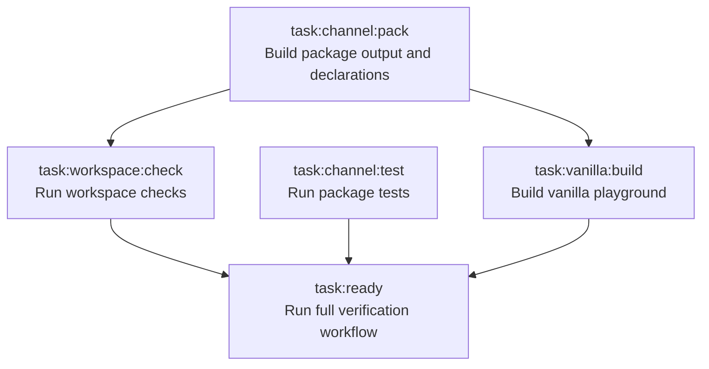

# channel

Workspace for `@blazeshomida/channel`.

`@blazeshomida/channel` is a typed message channel for workers and other transports. The package is currently private while the API is being explored.

## Workspace

```txt
packages/
  channel/

playgrounds/
  vanilla/
```

## Requirements

```txt
Node >= 22.12.0
pnpm 11.5.2
Vite+ CLI
```

## Commands

Install dependencies:

```sh
vp install
```

Run the full verification workflow:

```sh
vp run ready
```

Run the vanilla playground:

```sh
vp run dev:vanilla
```

Run the package build watcher:

```sh
vp run dev:package
```

Build the package:

```sh
vp run pack
```

Build the vanilla playground:

```sh
vp run build
```

Run package tests:

```sh
vp run test
```

Run workspace checks:

```sh
vp run check
```

## Package

The package source lives in:

```txt
packages/channel
```

Package build output is generated in:

```txt
packages/channel/dist
```

The vanilla playground imports the package through the workspace package name:

```ts
import { createChannel } from "@blazeshomida/channel";
```

This keeps the playground close to how an external consumer will use the package.

## Task graph

The workspace uses Vite+ tasks to keep package and playground checks ordered correctly.



`task:channel:pack` runs before workspace checks and playground builds so the vanilla playground can resolve the package through its built `dist` output.

`task:ready` runs:

1. `task:workspace:check`
2. `task:channel:test`
3. `task:vanilla:build`

## Changesets

This workspace uses Changesets for package versioning and changelog generation.

Create a changeset for user-facing package changes:

```sh
vp run changeset
```

Apply pending changesets locally:

```sh
vp run version
```

The release workflow uses Changesets to create release pull requests from changesets committed to `main`.

## Releases

Release automation is configured through GitHub Actions.

Publishing is currently disabled because `packages/channel/package.json` has:

```json
"private": true
```

To enable publishing later:

1. Remove `"private": true` from `packages/channel/package.json`.
2. Confirm package metadata is complete.
3. Configure npm trusted publishing for the `release.yml` workflow.
4. Merge a Changesets release pull request.

## Status

This workspace is release-ready infrastructure for an API that is still being designed. The next implementation milestone is the channel runtime: transport primitives, worker adapters, and a worker round trip in the vanilla playground.
