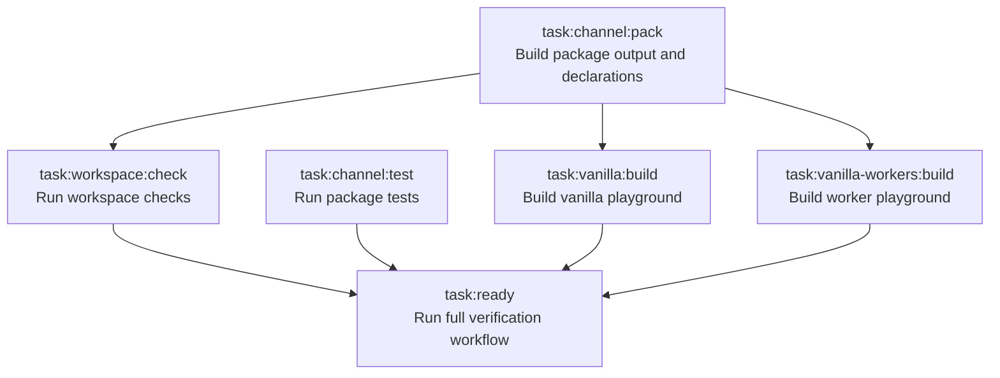

# channel

Workspace for `@blazeshomida/channel`.

> [!WARNING]
> This workspace is unstable while the package API is being explored. Expect breaking changes between commits until the package is marked ready for external use.

`@blazeshomida/channel` is a typed message channel for workers and other transports. The package is currently private while the API is being explored.

## Workspace

```txt
packages/
  channel/

playgrounds/
  vanilla/
  vanilla-workers/
```

## Requirements

```txt
Node >= 22.12.0
pnpm 11.5.2
Vite+ CLI
```

## Commands

Vite+ runs package scripts and configured tasks through `vp run`. The `vpr` command is the shorthand for `vp run`.

Install dependencies:

```sh
vp install
```

Run the full verification workflow:

```sh
vpr ready
```

Run the vanilla playground:

```sh
vpr dev:vanilla
```

Run the worker playground:

```sh
vpr dev:vanilla-workers
```

Run the package build watcher:

```sh
vpr dev:package
```

Build the package:

```sh
vpr pack
```

Build the vanilla playground:

```sh
vpr build
```

Build the worker playground:

```sh
vpr build:vanilla-workers
```

Run package tests:

```sh
vpr test
```

Run workspace checks:

```sh
vpr check
```

Format files:

```sh
vpr fmt
```

Lint files:

```sh
vpr lint
```

## Package

The package source lives in:

```txt
packages/channel
```

Package build output is generated in:

```txt
packages/channel/dist
```

The playgrounds import the package through the workspace package name:

```ts
import { createChannel } from "@blazeshomida/channel";
```

This keeps the playgrounds close to how an external consumer will use the package.

## Workspace Boundaries

Root config owns workspace-wide tooling and task orchestration. Package config owns package build, test, and publish behavior. Playground config owns browser/demo behavior.

```txt
vite.config.ts
packages/channel/vite.config.ts
playgrounds/vanilla/vite.config.ts
playgrounds/vanilla-workers/vite.config.ts
```

`tooling/` owns shared Vite+ formatting, linting, task, and pattern configuration. `.changeset/` owns package versioning and release intent. `.github/` owns CI, release, pull request, and issue templates.

## Import Aliases

Each package or playground owns its own `#/*` alias.

```json
{
  "compilerOptions": {
    "paths": {
      "#/*": ["./src/*"]
    }
  }
}
```

The alias means:

```txt
#/* = this package or playground's local src/*
```

Do not define `#/*` in the root `tsconfig.base.json`. In a monorepo, root aliases can accidentally point every package at the wrong source tree.

## File and Folder Conventions

Prefer vertical structure over horizontal structure.

Use the vertical codebase approach as the default reference:

- [The Vertical Codebase](https://tkdodo.eu/blog/the-vertical-codebase)

Group code by feature, domain, package concern, or workflow instead of by technical file type. Code that changes together should usually live together.

Rules:

- `index.ts` is the public boundary for a vertical.
- `_*.ts` files are private to the vertical.
- `_*/` folders are private implementation folders.
- Do not import from another vertical's `_` files.
- Promote code to shared only after at least two real call sites need it.
- Shared code should have a clear name and ownership.
- Avoid vague dumping grounds like `utils`.
- Keep tests near the code they verify when practical.
- Keep types near the code that owns them unless they are part of the public API.

## Task graph

The workspace uses Vite+ tasks to keep package and playground checks ordered correctly.



`task:channel:pack` runs before workspace checks and playground builds so the playgrounds can resolve the package through its built `dist` output.

`task:workspace:fmt` is intentionally uncached because it mutates source files. `task:workspace:lint` runs workspace linting. `task:workspace:check` runs formatting, linting, and TypeScript checks after package declarations exist.

`task:ready` runs:

1. `task:workspace:check`
2. `task:channel:test`
3. `task:vanilla:build`
4. `task:vanilla-workers:build`

## Changesets

This workspace uses Changesets for package versioning and changelog generation.

Create a changeset for user-facing package changes:

```sh
vpr changeset
```

Apply pending changesets locally:

```sh
vpr version
```

The release workflow uses Changesets to create release pull requests from changesets committed to `main`.

## Tooling

Vite+ owns the local workflow.

Root config:

```txt
vite.config.ts
```

Focused tooling config:

```txt
tooling/format.ts
tooling/lint.ts
tooling/patterns.ts
tooling/tasks.ts
```

Formatting sorts imports by type imports, built-ins/external packages, `#/*` project alias imports, relative imports, and unknown imports. The formatter also sorts package scripts.

Linting enables Vite+ lint rules, type-aware checks, and strict correctness categories.

Shared task input exclusions live in `tooling/patterns.ts`.

## Releases

Release automation is configured through GitHub Actions.

Publishing is currently disabled because `packages/channel/package.json` has:

```json
"private": true
```

To enable publishing later:

1. Remove `"private": true` from `packages/channel/package.json`.
2. Confirm package metadata is complete.
3. Configure npm trusted publishing for the `release.yml` workflow.
4. Merge a Changesets release pull request.

## Status

This workspace is release-ready infrastructure for an API that is still being designed. The current implementation includes channel primitives and worker transports. The next implementation milestone is a higher-level peer layer for request / response, events, errors, cancellation, and streams.
